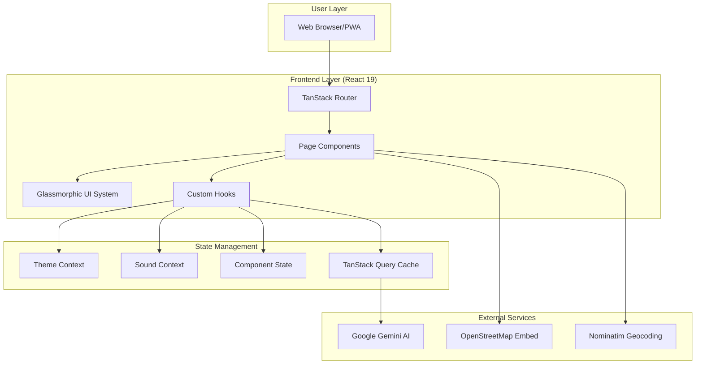
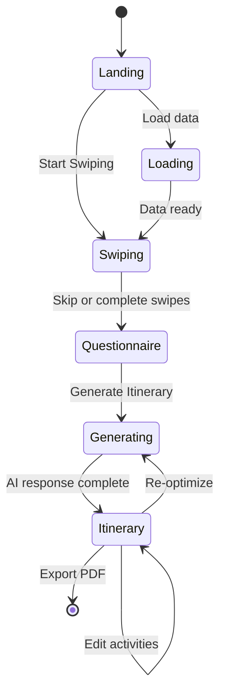
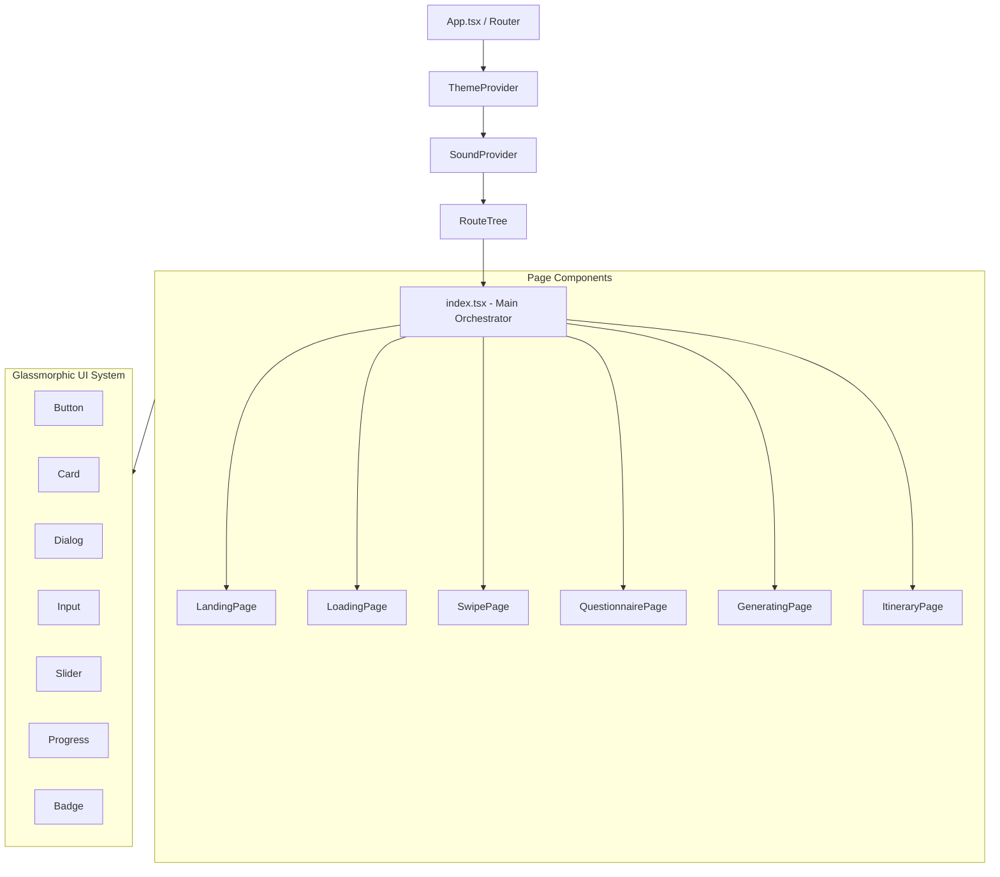
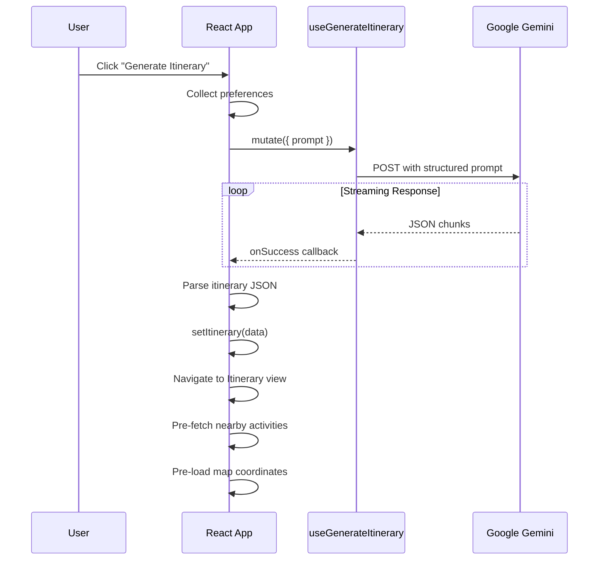
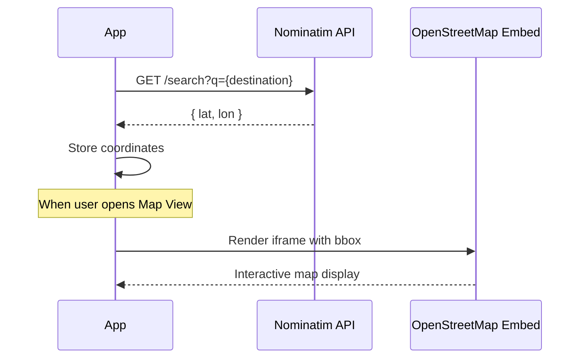

# System Architecture

Detailed technical documentation of Tratlus's architecture, design patterns, and system integrations.

---

## High-Level Architecture



---

## Application Flow



---

## Component Hierarchy



---

## State Management Strategy

### Local State (useState)
The primary state management approach, keeping state close to where it's used:

| State Category | Location | Purpose |
|----------------|----------|---------|
| App State | `index.tsx` | Current screen (landing, swiping, questionnaire, etc.) |
| Swipe Data | `index.tsx` | Current card, liked/disliked destinations |
| Questionnaire | `index.tsx` | Form values, dietary preferences, budget |
| Itinerary | `index.tsx` | Generated trip data, activities, days |
| UI State | `index.tsx` | Dialogs, editing mode, drag state |

### Context Providers

```typescript
// Theme Context
interface ThemeContext {
  isDarkMode: boolean;
  toggleTheme: () => void;
}

// Sound Context  
interface SoundContext {
  isMuted: boolean;
  volume: number;
  playSound: (type: string) => void;
  toggleMute: () => void;
}
```

### TanStack Query
Used for AI interactions with built-in caching, error handling, and streaming support.

---

## AI Integration Architecture

### Itinerary Generation Flow



### Prompt Engineering

The AI prompt includes:
- Destination and trip duration
- Liked/disliked destination tags with weighted scores
- Dietary restrictions and allergies
- Transportation preferences
- Accommodation requirements
- Budget constraints

Response structure enforced via JSON schema prompting.

---

## Map Integration



### Geocoding Strategy
- Coordinates fetched **immediately** after itinerary generation
- Stored in state for instant map display
- Fallback geocoding if coordinates not available

---

## Component Communication

### Props Flow (Prop Drilling Pattern)

```
index.tsx (Main Orchestrator)
    ├─> SwipePage
    │     ├─ destinations, currentIndex
    │     ├─ handleSwipe, handleSkip
    │     └─ isDarkMode, playSound
    │
    ├─> QuestionnairePage  
    │     ├─ formState (30+ form values)
    │     ├─ setters for each value
    │     └─ handleGenerate
    │
    └─> ItineraryPage
          ├─ itinerary data
          ├─ 40+ props for full functionality
          ├─ handlers for edit, delete, drag
          └─ map coordinates, nearby activities
```

### Design Decision: Prop Drilling vs Context
We chose prop drilling for page components because:
1. **Explicit data flow** - Easy to trace where data comes from
2. **No context re-render issues** - State changes only affect relevant components
3. **Type safety** - TypeScript catches missing props at compile time

---

## Performance Optimizations

### Implemented Strategies

| Strategy | Implementation |
|----------|----------------|
| **Code Splitting** | Page components in separate files |
| **Memoization** | `useCallback` for stable handlers |
| **Lazy Map Loading** | Coordinates pre-fetched, map iframe loaded on demand |
| **Optimistic UI** | Immediate feedback on interactions |
| **Animation Performance** | CSS transforms, will-change hints |

### Bundle Considerations
- Tree-shaking via Vite/Rolldown
- Dynamic imports for heavy components
- SVG icons instead of font icons
- Minimal dependencies

---

## File Organization Philosophy

```
src/
├── components/
│   ├── pages/     # Feature pages (extracted from index.tsx)
│   ├── ui/        # shadcn/ui primitives (button, card, dialog...)
│   ├── landing/   # Landing page specific components
│   └── data/      # Static data (destinations, tags)
├── hooks/         # Reusable logic (AI, responsive)
├── contexts/      # Global state (theme, sound)
├── routes/        # TanStack Router file-based routes
└── lib/           # Utilities (cn, helpers)
```

### Separation of Concerns
- **index.tsx**: State management and orchestration (~2100 lines)
- **Page Components**: UI rendering and local interactions
- **Hooks**: Reusable business logic
- **UI Components**: Presentational primitives

---

## Security Considerations

| Concern | Mitigation |
|---------|------------|
| **API Key Exposure** | `.env` file with `VITE_` prefix, gitignored |
| **XSS in User Input** | React's built-in escaping |
| **iframe Security** | OpenStreetMap trusted source |
| **Input Validation** | Zod schemas for form data |

---

## Future Architecture Considerations

- **Backend Integration**: Supabase or similar for trip persistence
- **Auth**: User accounts for saved itineraries
- **Real-time Collaboration**: Share trips with travel companions
- **Offline Support**: Service worker for PWA offline mode
