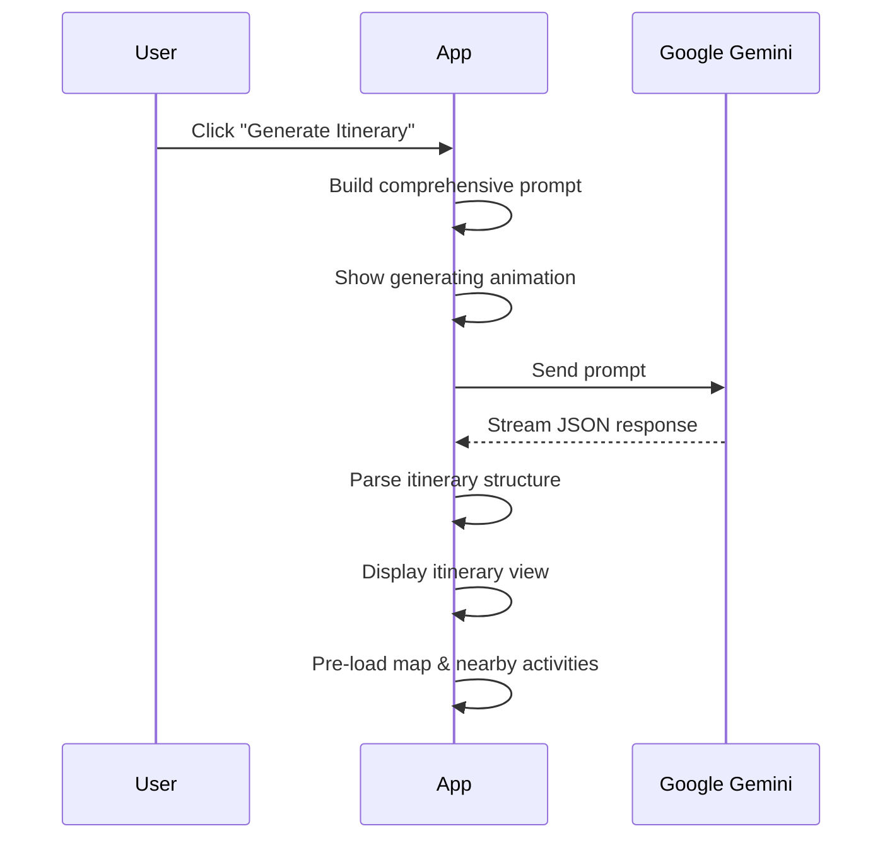

# Feature Deep Dive

Comprehensive documentation of Tratlus's core features, implementation details, and user experience design.

---

## 🎴 Swipe-Based Preference Discovery

### The Swipe Experience

Inspired by dating apps, Tratlus uses familiar swipe gestures to discover travel preferences:

1. **Destination Cards**: 50+ curated destinations with images, tags, and descriptions
2. **Swipe Actions**: 
   - ❤️ **Like** (right swipe or heart button)
   - ❌ **Dislike** (left swipe or X button)
   - ⏭️ **Skip** (skip button)
3. **Gesture Support**: Touch and mouse drag with spring animations

### Preference Algorithm

```
For each destination swiped:
├── Extract destination tags (beach, culture, adventure, etc.)
├── If LIKED:
│   └── Add weighted score to each tag
├── If DISLIKED:
│   └── Add negative weight to each tag
└── Update calibration progress
```

### Tag Categories

| Category | Example Tags |
|----------|-------------|
| **Landscape** | Beach, Mountains, Desert, Tropical |
| **Culture** | Historical, Art, Religious, Modern Architecture |
| **Activities** | Adventure, Nightlife, Sports, Relaxation |
| **Food** | Foodie, Street Food, Fine Dining, Local Cuisine |
| **Vibe** | Romantic, Family, Solo, Budget-Friendly |

### UI Features
- **Calibration Progress**: Shows how well preferences are understood
- **Quick Skip**: Jump directly to questionnaire
- **Real-time Feedback**: Color overlays indicate like/dislike
- **Smooth Animations**: Cards snap back or fly off screen

---

## 📋 Multi-Step Questionnaire

### Step 1: Taste & Preferences

**Dietary Needs**
- Checkboxes: Vegetarian, Vegan, Halal, Kosher, Gluten-Free, Dairy-Free, Nut-Free
- Text input for allergies and specific requirements

**Food Adventurousness**
- Slider from 1-10
- Labels: "Stick to familiar" → "Try anything"

**Meal Budget**
- Options: Budget, Moderate, Upscale, Luxury
- Affects restaurant recommendations in itinerary

---

### Step 2: Style & Comfort

**Transportation Priority**
- Options: Speed, Comfort, Cost, Eco-Friendly
- Affects transport recommendations between activities

**Accommodation Type**
- Multi-select: Hotel, Resort, Boutique Hotel, Hostel, Airbnb, Vacation Rental
- Star rating range: Min to Max stars

**Amenities**
- Multi-select: Pool, Gym, Spa, Free Breakfast, Kitchen, Parking, WiFi
- Filters accommodation suggestions

**Budget Per Night**
- Slider with dollar amount
- Range: $50 - $500+

---

### Step 3: Trip Details

**Destination**
- Text input with validation
- Pre-filled from top liked destination

**Departure Location**
- Text input for starting point
- Used for transport planning

**Trip Duration**
- Slider: 1-14 days
- Affects itinerary day count

**Date Selection**
- Calendar picker for start date
- Integrated with day picker component

---

## 🤖 AI-Powered Itinerary Generation

### The Generation Process



### Prompt Structure

The AI receives a detailed prompt including:
- Destination and trip length
- **Preference scores** from swipe data
- **Avoid tags** from disliked destinations
- Dietary restrictions and allergies
- Transportation and accommodation preferences
- Budget constraints

### Response Format

```typescript
interface TravelItinerary {
  destination: string;
  totalDays: number;
  totalEstimatedCost: number;
  days: ItineraryDay[];
}

interface ItineraryDay {
  day: number;
  date: string;
  theme: string;
  activities: Activity[];
}

interface Activity {
  time: string;
  title: string;
  location: string;
  description: string;
  estimatedCost: number;
  duration?: string;
  type: 'food' | 'attraction' | 'activity' | 'transportation';
  rating?: number;
}
```

### Generation Animation
- Pulsing airplane icon
- Animated loading messages
- Progress indication

---

## 🗺️ Interactive Itinerary View

### Day-by-Day Timeline

Each day displayed as a card with:
- **Day number and date**
- **Theme** (e.g., "Cultural Exploration", "Beach Day")
- **Timeline of activities** with times
- **Expandable details** for each activity

### Activity Cards

For each activity:
- **Title** with location
- **Time and duration**
- **Description**
- **Estimated cost** with running total
- **Type indicator** (food, attraction, etc.)
- **Action buttons**: Edit, Delete, Move

### Drag & Drop Reordering

- Drag handle on each activity
- Visual feedback during drag
- Automatic time recalculation
- Works on touch devices

### Cost Tracking

- Per-activity cost display
- Per-day subtotal
- Trip total with real-time updates
- Currency formatting

---

## 🗺️ Map Integration

### Map View Dialog

- **OpenStreetMap embed** centered on destination
- **Pre-loaded coordinates** via Nominatim geocoding
- **Legend** for activity types (color-coded)
- **Instant display** - no loading on click

### Map Legend

| Color | Type |
|-------|------|
| 🟠 Amber | Food & Restaurants |
| 🔵 Cyan | Attractions & Landmarks |
| 🟢 Green | Activities & Parks |
| 🟣 Purple | Accommodation |

---

## ➕ Adding Activities

### Add Activity Dialog

When adding a custom activity:
- **Title** (required)
- **Time** selection
- **Duration** estimate
- **Location** address
- **Description** text area
- **Estimated cost** input
- **Activity type** dropdown

Activities inserted with automatic sorting by time.

---

## 🔄 Re-Optimize Feature

Users can request a new AI optimization:
- Keeps current destination and dates
- Regenerates activities based on:
  - Current preference data
  - Any manual changes made
  - Updated constraints

---

## 📄 Export Options

### PDF Export

Generates a professional PDF with:
- **Trip title and dates**
- **Day-by-day breakdown**
- **Activity details** formatted nicely
- **Cost summary**
- Powered by jsPDF

### Email Sharing

- Opens email client with:
  - Subject line with trip name
  - Body with trip summary
  - Call to action

### Calendar Integration

- Add to calendar button
- Opens device calendar
- Pre-filled event details

---

## 🌙 Explore Nearby

### Nearby Activities Panel

After itinerary generation, users can explore:
- **Additional restaurants** in the area
- **Hidden gem attractions**
- **Local activities** off the beaten path

### Category Filter

- All, Food, Attractions, Activities tabs
- Filtered recommendations
- Quick-add to any day

### Add to Itinerary

One-click to add nearby activity:
- Select target day
- Auto-fills time slot
- Updates day structure

---

## ⚙️ User Preferences

### Theme Toggle

- **Light mode**: Clean white backgrounds
- **Dark mode**: Elegant dark glassmorphism
- **System preference** detection
- Persistent across sessions

### Sound Controls

- **Mute toggle**: On/off
- **Volume slider**: Fine control
- Sound effects for:
  - Card swipes
  - Button clicks
  - Success actions

### Mobile Optimizations

- **Portrait lock** for PWA
- **Touch-optimized** gestures
- **Safe area** handling for notched devices
- **Responsive** breakpoints

---

## 🚀 Performance Features

### Optimistic UI

- Instant feedback on all actions
- Updates before server confirmation
- Rollback on errors

### Pre-loading Strategy

- Map coordinates fetched on itinerary generation
- Nearby activities pre-fetched in background
- Smooth transitions between views

### Animation Performance

- GPU-accelerated transforms
- Reduced motion support
- Consistent 60fps on mobile
